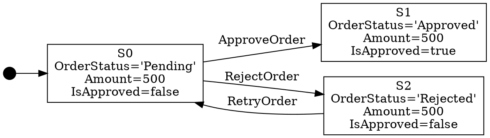
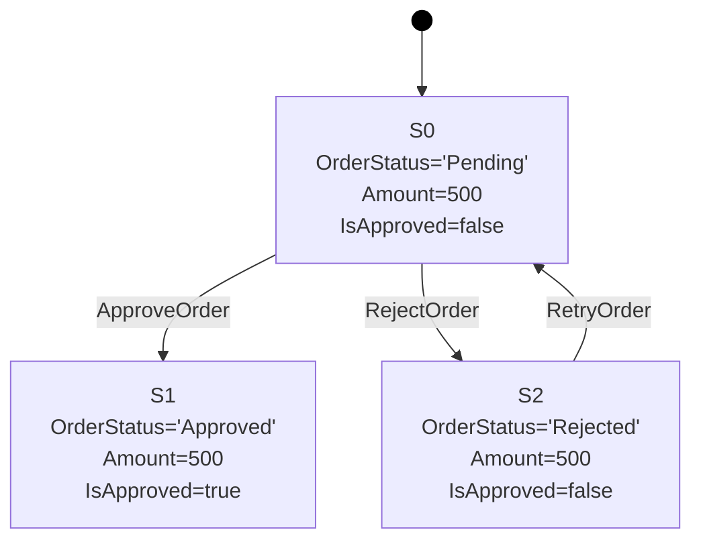

# Export Formats Architecture

## Overview

StateMaker can export generated state machines to three formats: **JSON**, **GraphML**, and **DOT**. Each format represents the same data - states, transitions, and rule names - but is optimized for different use cases.

StateMaker can also **import** a state machine from JSON, enabling round-trip workflows where a state machine is built, stored, and later re-exported to a visualization format.

## JSON Format

### Purpose
- Machine-readable storage and interchange
- Round-trip import/export
- Integration with other tools and pipelines
- Version control friendly

### Structure

A built state machine exported to JSON has the following structure:

```json
{
  "startingStateId": "S0",
  "states": {
    "S0": {
      "OrderStatus": "Pending",
      "Amount": 500,
      "IsApproved": false
    },
    "S1": {
      "OrderStatus": "Approved",
      "Amount": 500,
      "IsApproved": true
    },
    "S2": {
      "OrderStatus": "Rejected",
      "Amount": 500,
      "IsApproved": false
    }
  },
  "transitions": [
    {
      "sourceStateId": "S0",
      "targetStateId": "S1",
      "ruleName": "ApproveOrder"
    },
    {
      "sourceStateId": "S0",
      "targetStateId": "S2",
      "ruleName": "RejectOrder"
    },
    {
      "sourceStateId": "S2",
      "targetStateId": "S0",
      "ruleName": "RetryOrder"
    }
  ]
}
```

### Field Descriptions

| Field | Type | Description |
|---|---|---|
| `startingStateId` | string | ID of the initial state |
| `states` | object | Map of state IDs to their variable key-value pairs |
| `states.<id>` | object | A single state's variables as key-value pairs. Keys are variable names (string), values are primitives (string, int, bool, float) |
| `transitions` | array | List of all transitions |
| `transitions[].sourceStateId` | string | State ID the transition originates from |
| `transitions[].targetStateId` | string | State ID the transition leads to |
| `transitions[].ruleName` | string | Name of the rule that caused this transition |

### State Representation in JSON

Each state is represented as a flat object of variable name/value pairs:

```json
"S0": {
  "OrderStatus": "Pending",
  "Amount": 500,
  "IsApproved": false
}
```

- Variable names are strings
- Values are JSON primitives matching the supported types:
  - `string` → JSON string: `"Pending"`
  - `int` → JSON number: `500`
  - `bool` → JSON boolean: `true` / `false`
  - `float/double` → JSON number: `3.14`

### Import from JSON

A previously exported JSON file can be imported back into a `StateMachine` object using the import mechanism. The imported state machine:
- Preserves all state IDs, variable names, and values
- Preserves all transitions and rule names
- Can be re-exported to any supported format

## DOT Format (Graphviz)

### Purpose
- Text-based graph description language
- Visualized using Graphviz tools (`dot`, `neato`, `fdp`)
- Simple, human-readable syntax
- Good for quick visualization and debugging

### Target Tools
- **Graphviz** command-line: `dot -Tpng output.dot -o output.png`
- **Online editors**: Graphviz Online, Edotor
- **IDE extensions**: Graphviz Preview for VSCode

### Structure



### State Representation in DOT

States are rendered as **box nodes** with a label containing the state ID followed by variable name/value pairs, one per line. String values are wrapped in single quotes, booleans are `true`/`false`.

```dot
"S0" [label="S0\nOrderStatus='Pending'\nAmount=500\nIsApproved=false"];
```

Rendered as:

```
┌────────────────────────┐
│ S0                     │
│ OrderStatus='Pending'  │
│ Amount=500             │
│ IsApproved=false       │
└────────────────────────┘
```

### Transition Representation in DOT

Transitions are rendered as **directed edges** with the rule name as label:

```dot
"S0" -> "S1" [label="ApproveOrder"];
```

### Starting State Indicator

The starting state is indicated by an arrow from an invisible point node named `__start`:

```dot
__start [shape=point, width=0.2, label=""];
__start -> "S0";
```

## GraphML Format (yEd)

### Purpose
- XML-based graph interchange format
- Full support in yEd graph editor
- Rich visual properties (colors, shapes, sizes)
- Supports hierarchical and grouped layouts
- Good for presentation-quality diagrams

### Target Tools
- **yEd** (primary target): Free graph editor by yWorks
- **Gephi**: Open-source network analysis
- **Cytoscape**: Network visualization

### Structure

```xml
<?xml version="1.0" encoding="utf-16"?>
<graphml xmlns="http://graphml.graphstruct.org/xmlns"
         xmlns:y="http://www.yworks.com/xml/graphml">

  <!-- Key declarations for yEd visual properties -->
  <key id="d0" for="node" yfiles.type="nodegraphics" />
  <key id="d1" for="edge" yfiles.type="edgegraphics" />

  <graph id="G" edgedefault="directed">

    <!-- Starting state (green fill, thick border) -->
    <node id="S0">
      <data key="d0">
        <y:ShapeNode>
          <y:Geometry height="60.0" width="120.0" />
          <y:Fill color="#CCFFCC" />
          <y:BorderStyle color="#000000" type="line" width="2.0" />
          <y:NodeLabel>S0
OrderStatus='Pending'
Amount=500
IsApproved=false</y:NodeLabel>
          <y:Shape type="roundrectangle" />
        </y:ShapeNode>
      </data>
    </node>

    <!-- Non-starting state (white fill, normal border) -->
    <node id="S1">
      <data key="d0">
        <y:ShapeNode>
          <y:Geometry height="60.0" width="120.0" />
          <y:Fill color="#FFFFFF" />
          <y:BorderStyle color="#000000" type="line" width="1.0" />
          <y:NodeLabel>S1
OrderStatus='Approved'
Amount=500
IsApproved=true</y:NodeLabel>
          <y:Shape type="roundrectangle" />
        </y:ShapeNode>
      </data>
    </node>

    <!-- Transition edges -->
    <edge id="e0" source="S0" target="S1">
      <data key="d1">
        <y:PolyLineEdge>
          <y:LineStyle color="#000000" type="line" width="1.0" />
          <y:Arrows source="none" target="standard" />
          <y:EdgeLabel>ApproveOrder</y:EdgeLabel>
        </y:PolyLineEdge>
      </data>
    </edge>

  </graph>
</graphml>
```

### State Representation in GraphML

Each state is a `<node>` element containing:
1. **Node ID** matching the state ID (e.g., `S0`)
2. **Label** containing the state ID and all variables (one per line)
3. **Visual properties** (shape, color, size, border)

The starting state is visually distinguished with a green fill (`#CCFFCC`) and thicker border (`2.0`). Non-starting states have a white fill (`#FFFFFF`) and normal border (`1.0`).

### State Variable Representation

Variables are listed in the node label, one per line (string values in single quotes):
```
S0
VariableName1='Value1'
VariableName2=500
```

### Transition Representation in GraphML

Each transition is an `<edge>` element with line styling and an edge label:
```xml
<edge id="e0" source="S0" target="S1">
  <data key="d1">
    <y:PolyLineEdge>
      <y:LineStyle color="#000000" type="line" width="1.0" />
      <y:Arrows source="none" target="standard" />
      <y:EdgeLabel>ApproveOrder</y:EdgeLabel>
    </y:PolyLineEdge>
  </data>
</edge>
```

### Visualization Properties

| Property | GraphML Element | Starting State | Other States |
|---|---|---|---|
| Node shape | `<y:Shape type="roundrectangle"/>` | roundrectangle | roundrectangle |
| Fill color | `<y:Fill color="..."/>` | `#CCFFCC` (light green) | `#FFFFFF` (white) |
| Border width | `<y:BorderStyle width="..."/>` | `2.0` (thick) | `1.0` (normal) |
| Node size | `<y:Geometry height="60.0" width="120.0"/>` | Fixed | Fixed |
| Edge labels | `<y:EdgeLabel>` | Rule name displayed on the edge | |
| Arrow style | `<y:Arrows target="standard"/>` | Standard arrowhead | |

### Using in yEd

1. Open yEd
2. File > Open > select the `.graphml` file
3. Layout > Hierarchical (recommended for state machines)
4. The graph renders with all states, variables, and transitions visible
5. Use yEd's layout algorithms to arrange the graph

## Mermaid Format

### Purpose
- Text-based diagram syntax rendered by Mermaid.js
- Native support in GitHub markdown, GitLab, Notion, and many documentation tools
- No external tools needed — renders directly in browsers
- Good for embedding state machine diagrams in documentation and README files

### Target Tools
- **GitHub**: Renders Mermaid in markdown files and PR descriptions
- **Mermaid Live Editor**: https://mermaid.live
- **IDE extensions**: Mermaid Preview for VSCode
- **Documentation tools**: Docusaurus, MkDocs, Notion

### Structure



### State Representation in Mermaid

States are defined as flowchart nodes with a quoted label containing the state ID followed by variable name/value pairs separated by `<br />`. HTML entities are used to escape `<`, `>`, and `&` in values:

```
S0["S0<br />OrderStatus='Pending'<br />Amount=500"]
```

### Transition Representation in Mermaid

Transitions use the `-->` arrow with a pipe-delimited label:

```
S0 -->|ApproveOrder| S1
```

### Starting State Indicator

The starting state is indicated using a filled circle node:

```
_start_((" ")) --> S0
style _start_ fill:#000,stroke:#000,color:#000
```

## Format Comparison

| Feature | JSON | DOT | GraphML | Mermaid |
|---|---|---|---|---|
| Human readable | Moderate | High | Low (XML) | High |
| Machine readable | High | Low | Moderate | Moderate |
| Round-trip import | Yes | No | No | No |
| Visualization | Via JSON viewers | Graphviz | yEd | Mermaid.js / GitHub |
| State variables | Key-value pairs | Node labels | Node labels | State labels |
| Transition labels | Rule name field | Edge labels | Edge labels | Edge labels |
| Visual styling | None | Basic | Rich | Basic |
| File size | Small | Small | Large (XML overhead) | Small |
| Version control | Good (diffable) | Good (diffable) | Poor (XML noise) | Good (diffable) |

## Implementation Notes

### Export Interface

```csharp
public interface IStateMachineExporter
{
    string Export(StateMachine stateMachine);
}

public class JsonExporter : IStateMachineExporter { ... }
public class DotExporter : IStateMachineExporter { ... }
public class GraphMlExporter : IStateMachineExporter { ... }
public class MermaidExporter : IStateMachineExporter { ... }
```

### Import Interface

```csharp
public interface IStateMachineImporter
{
    StateMachine Import(string content);
}

public class JsonImporter : IStateMachineImporter { ... }
```

Only JSON import is supported. DOT, GraphML, and Mermaid are export-only formats.

### Node Label Generation

For DOT, GraphML, and Mermaid, state labels are generated from the state ID followed by variable key=value pairs. Values are formatted by type: strings in single quotes, booleans as `true`/`false`, nulls as `null`, and numbers as-is.

Variables appear in dictionary iteration order (insertion order). They are not sorted alphabetically.

## Related Documentation

- [State Machine Builder Architecture](./builder-architecture.md)
- [Declarative Rules Architecture](./declarative-rules.md)
- [State Immutability](./state-immutability.md)

## References

- PRD Section: Export and Import Capabilities (FR 25-31)
- User Story 3: System Analyst - Export for Visualization
- Scenario 3: System Analyst exports for visualization
