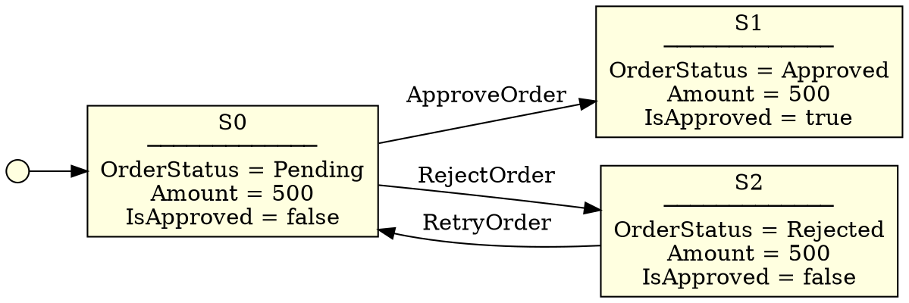
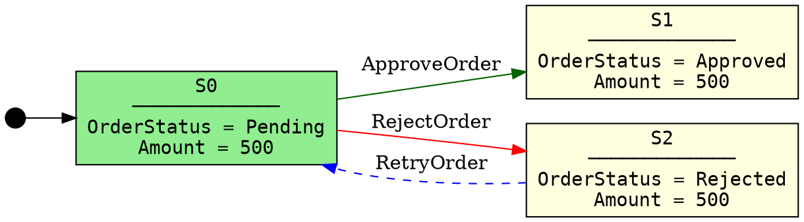

# Export Formats Architecture

## Overview

StateMaker can export generated state machines to three formats: **JSON**, **GraphML**, and **DOT**. Each format represents the same data - states, transitions, and rule names - but is optimized for different use cases.

StateMaker can also **import** a state machine from JSON, enabling round-trip workflows where a state machine is built, stored, and later re-exported to a visualization format.

## JSON Format

### Purpose
- Machine-readable storage and interchange
- Round-trip import/export
- Integration with other tools and pipelines
- Version control friendly

### Structure

A built state machine exported to JSON has the following structure:

```json
{
  "startingStateId": "S0",
  "states": {
    "S0": {
      "OrderStatus": "Pending",
      "Amount": 500,
      "IsApproved": false
    },
    "S1": {
      "OrderStatus": "Approved",
      "Amount": 500,
      "IsApproved": true
    },
    "S2": {
      "OrderStatus": "Rejected",
      "Amount": 500,
      "IsApproved": false
    }
  },
  "transitions": [
    {
      "sourceStateId": "S0",
      "targetStateId": "S1",
      "ruleName": "ApproveOrder"
    },
    {
      "sourceStateId": "S0",
      "targetStateId": "S2",
      "ruleName": "RejectOrder"
    },
    {
      "sourceStateId": "S2",
      "targetStateId": "S0",
      "ruleName": "RetryOrder"
    }
  ]
}
```

### Field Descriptions

| Field | Type | Description |
|---|---|---|
| `startingStateId` | string | ID of the initial state |
| `states` | object | Map of state IDs to their variable key-value pairs |
| `states.<id>` | object | A single state's variables as key-value pairs. Keys are variable names (string), values are primitives (string, int, bool, float) |
| `transitions` | array | List of all transitions |
| `transitions[].sourceStateId` | string | State ID the transition originates from |
| `transitions[].targetStateId` | string | State ID the transition leads to |
| `transitions[].ruleName` | string | Name of the rule that caused this transition |

### State Representation in JSON

Each state is represented as a flat object of variable name/value pairs:

```json
"S0": {
  "OrderStatus": "Pending",
  "Amount": 500,
  "IsApproved": false
}
```

- Variable names are strings
- Values are JSON primitives matching the supported types:
  - `string` → JSON string: `"Pending"`
  - `int` → JSON number: `500`
  - `bool` → JSON boolean: `true` / `false`
  - `float/double` → JSON number: `3.14`

### Import from JSON

A previously exported JSON file can be imported back into a `StateMachine` object using the import mechanism. The imported state machine:
- Preserves all state IDs, variable names, and values
- Preserves all transitions and rule names
- Can be re-exported to any supported format

## DOT Format (Graphviz)

### Purpose
- Text-based graph description language
- Visualized using Graphviz tools (`dot`, `neato`, `fdp`)
- Simple, human-readable syntax
- Good for quick visualization and debugging

### Target Tools
- **Graphviz** command-line: `dot -Tpng output.dot -o output.png`
- **Online editors**: Graphviz Online, Edotor
- **IDE extensions**: Graphviz Preview for VSCode

### Structure



### State Representation in DOT

States are rendered as **box nodes** with a label containing:
1. The state ID (e.g., `S0`)
2. A separator line
3. All variable names and values, one per line

```dot
S0 [label="S0\n─────────────\nOrderStatus = Pending\nAmount = 500\nIsApproved = false"];
```

Rendered as:

```
┌───────────────────────┐
│ S0                    │
│ ───────────────────── │
│ OrderStatus = Pending │
│ Amount = 500          │
│ IsApproved = false    │
└───────────────────────┘
```

### Transition Representation in DOT

Transitions are rendered as **directed edges** with the rule name as label:

```dot
S0 -> S1 [label="ApproveOrder"];
```

### Starting State Indicator

The starting state is indicated by an arrow from an invisible point node:

```dot
start [shape=point, width=0.2];
start -> S0;
```

### Visualization Options

| Option | DOT Attribute | Description |
|---|---|---|
| Layout direction | `rankdir=LR` | Left-to-right (default). Use `TB` for top-to-bottom |
| Node shape | `node [shape=box]` | Box for states. Alternatives: `ellipse`, `record` |
| Node color | `fillcolor=lightyellow` | Background color for state nodes |
| Starting state color | `fillcolor=lightgreen` | Different color to highlight the starting state |
| Edge color | `color=blue` | Color for transition arrows |
| Font | `fontname="Courier"` | Monospace font for variable alignment |

### Example with Options



## GraphML Format (yEd)

### Purpose
- XML-based graph interchange format
- Full support in yEd graph editor
- Rich visual properties (colors, shapes, sizes)
- Supports hierarchical and grouped layouts
- Good for presentation-quality diagrams

### Target Tools
- **yEd** (primary target): Free graph editor by yWorks
- **Gephi**: Open-source network analysis
- **Cytoscape**: Network visualization

### Structure

```xml
<?xml version="1.0" encoding="UTF-8"?>
<graphml xmlns="http://graphml.graphstudio.org"
         xmlns:y="http://www.yworks.com/xml/graphml">

  <!-- Property declarations -->
  <key id="d0" for="node" attr.name="label" attr.type="string"/>
  <key id="d1" for="edge" attr.name="label" attr.type="string"/>
  <key id="d2" for="node" yfiles.type="nodegraphics"/>
  <key id="d3" for="edge" yfiles.type="edgegraphics"/>

  <graph id="StateMachine" edgedefault="directed">

    <!-- State nodes -->
    <node id="S0">
      <data key="d0">S0</data>
      <data key="d2">
        <y:ShapeNode>
          <y:Geometry height="80" width="200"/>
          <y:Fill color="#CCFFCC"/>
          <y:NodeLabel>S0
─────────────
OrderStatus = Pending
Amount = 500
IsApproved = false</y:NodeLabel>
          <y:Shape type="roundrectangle"/>
        </y:ShapeNode>
      </data>
    </node>

    <node id="S1">
      <data key="d0">S1</data>
      <data key="d2">
        <y:ShapeNode>
          <y:Geometry height="80" width="200"/>
          <y:Fill color="#FFFFCC"/>
          <y:NodeLabel>S1
─────────────
OrderStatus = Approved
Amount = 500
IsApproved = true</y:NodeLabel>
          <y:Shape type="roundrectangle"/>
        </y:ShapeNode>
      </data>
    </node>

    <node id="S2">
      <data key="d0">S2</data>
      <data key="d2">
        <y:ShapeNode>
          <y:Geometry height="80" width="200"/>
          <y:Fill color="#FFFFCC"/>
          <y:NodeLabel>S2
─────────────
OrderStatus = Rejected
Amount = 500
IsApproved = false</y:NodeLabel>
          <y:Shape type="roundrectangle"/>
        </y:ShapeNode>
      </data>
    </node>

    <!-- Transition edges -->
    <edge id="e0" source="S0" target="S1">
      <data key="d1">ApproveOrder</data>
      <data key="d3">
        <y:PolyLineEdge>
          <y:EdgeLabel>ApproveOrder</y:EdgeLabel>
          <y:Arrows source="none" target="standard"/>
        </y:PolyLineEdge>
      </data>
    </edge>

    <edge id="e1" source="S0" target="S2">
      <data key="d1">RejectOrder</data>
      <data key="d3">
        <y:PolyLineEdge>
          <y:EdgeLabel>RejectOrder</y:EdgeLabel>
          <y:Arrows source="none" target="standard"/>
        </y:PolyLineEdge>
      </data>
    </edge>

    <edge id="e2" source="S2" target="S0">
      <data key="d1">RetryOrder</data>
      <data key="d3">
        <y:PolyLineEdge>
          <y:EdgeLabel>RetryOrder</y:EdgeLabel>
          <y:Arrows source="none" target="standard"/>
        </y:PolyLineEdge>
      </data>
    </edge>

  </graph>
</graphml>
```

### State Representation in GraphML

Each state is a `<node>` element containing:
1. **Node ID** matching the state ID (e.g., `S0`)
2. **Label** containing the state ID and all variables
3. **Visual properties** (shape, color, size)

```xml
<node id="S0">
  <data key="d2">
    <y:ShapeNode>
      <y:Geometry height="80" width="200"/>
      <y:Fill color="#CCFFCC"/>
      <y:NodeLabel>S0
─────────────
OrderStatus = Pending
Amount = 500</y:NodeLabel>
      <y:Shape type="roundrectangle"/>
    </y:ShapeNode>
  </data>
</node>
```

### State Variable Representation

Variables are listed in the node label, one per line:
```
S0
─────────────
VariableName1 = Value1
VariableName2 = Value2
```

### Transition Representation in GraphML

Each transition is an `<edge>` element:
```xml
<edge id="e0" source="S0" target="S1">
  <data key="d3">
    <y:PolyLineEdge>
      <y:EdgeLabel>ApproveOrder</y:EdgeLabel>
      <y:Arrows source="none" target="standard"/>
    </y:PolyLineEdge>
  </data>
</edge>
```

### Visualization Options in yEd

| Option | GraphML Element | Description |
|---|---|---|
| Node shape | `<y:Shape type="..."/>` | `roundrectangle`, `rectangle`, `ellipse` |
| Node color | `<y:Fill color="..."/>` | Hex color code for node background |
| Starting state color | `#CCFFCC` (light green) | Distinguish starting state from others |
| Other states color | `#FFFFCC` (light yellow) | Default state color |
| Node size | `<y:Geometry height="..." width="..."/>` | Auto-sized based on variable count |
| Edge labels | `<y:EdgeLabel>` | Rule name displayed on the edge |
| Arrow style | `<y:Arrows target="..."/>` | `standard`, `delta`, `diamond` |
| Layout | Applied in yEd | Hierarchical, Organic, Orthogonal |

### Using in yEd

1. Open yEd
2. File > Open > select the `.graphml` file
3. Layout > Hierarchical (recommended for state machines)
4. The graph renders with all states, variables, and transitions visible
5. Use yEd's layout algorithms to arrange the graph

## Format Comparison

| Feature | JSON | DOT | GraphML |
|---|---|---|---|
| Human readable | Moderate | High | Low (XML) |
| Machine readable | High | Low | Moderate |
| Round-trip import | Yes | No | No |
| Visualization | Via JSON viewers | Graphviz | yEd |
| State variables | Key-value pairs | Node labels | Node labels |
| Transition labels | Rule name field | Edge labels | Edge labels |
| Visual styling | None | Basic | Rich |
| File size | Small | Small | Large (XML overhead) |
| Version control | Good (diffable) | Good (diffable) | Poor (XML noise) |

## Implementation Notes

### Export Interface

```csharp
public interface IStateMachineExporter
{
    string Export(StateMachine stateMachine);
}

public class JsonExporter : IStateMachineExporter { ... }
public class DotExporter : IStateMachineExporter { ... }
public class GraphMlExporter : IStateMachineExporter { ... }
```

### Import Interface

```csharp
public interface IStateMachineImporter
{
    StateMachine Import(string content);
}

public class JsonImporter : IStateMachineImporter { ... }
```

Only JSON import is supported. DOT and GraphML are export-only formats.

### Node Label Generation

For both DOT and GraphML, state labels are generated consistently:

```csharp
string GenerateLabel(string stateId, State state)
{
    var lines = new List<string> { stateId, "─────────────" };
    foreach (var kvp in state.Variables.OrderBy(k => k.Key))
    {
        lines.Add($"{kvp.Key} = {kvp.Value}");
    }
    return string.Join("\n", lines);
}
```

Variables are sorted alphabetically by key for consistent output.

## Related Documentation

- [State Machine Builder Architecture](./builder-architecture.md)
- [Declarative Rules Architecture](./declarative-rules.md)
- [State Immutability](./state-immutability.md)

## References

- PRD Section: Export and Import Capabilities (FR 25-31)
- User Story 3: System Analyst - Export for Visualization
- Scenario 3: System Analyst exports for visualization
