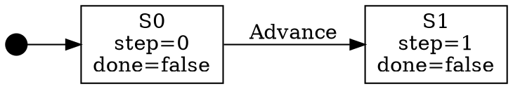
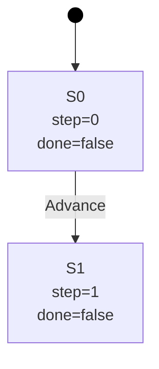

# StateMaker Console Usage

StateMaker is a command-line tool that builds state machines from JSON definition files and exports them to multiple output formats.

## Commands

### `build`

Builds a state machine from a build definition file.

```
statemaker.console build <definition-file> [options]
```

| Option | Short | Description | Default |
|--------|-------|-------------|---------|
| `--format` | `-f` | Output format: `json`, `dot`, `graphml`, `mermaid` | `json` |
| `--output` | `-o` | Output file path | stdout |

**Examples:**

```
statemaker.console build definition.json
statemaker.console build definition.json --format dot
statemaker.console build definition.json -f graphml -o machine.graphml
statemaker.console build definition.json --format dot --output graph.dot
```

### `export`

Loads a previously built JSON state machine and exports it to another format.

```
statemaker.console export <state-machine-file> [options]
```

| Option | Short | Description | Default |
|--------|-------|-------------|---------|
| `--format` | `-f` | Output format: `json`, `dot`, `graphml`, `mermaid` | `json` |
| `--output` | `-o` | Output file path | stdout |
| `--filter` | | Filter definition file to apply before exporting | none |

**Examples:**

```
statemaker.console export machine.json --format dot
statemaker.console export machine.json -f graphml -o machine.graphml
statemaker.console export machine.json --filter filter.json --format dot
```

### `filter`

Applies a filter definition to a state machine, performs path traversal to extract matching paths, and exports the result.

```
statemaker.console filter <state-machine-file> <filter-file> [options]
```

| Option | Short | Description | Default |
|--------|-------|-------------|---------|
| `--format` | `-f` | Output format: `json`, `dot`, `graphml`, `mermaid` | `json` |
| `--output` | `-o` | Output file path | stdout |
| `--list` | | Output matching states as a JSON array (no path traversal) | off |

**Examples:**

```
statemaker.console filter machine.json filter.json
statemaker.console filter machine.json filter.json --format dot
statemaker.console filter machine.json filter.json --list
statemaker.console filter machine.json filter.json --list -o matches.json
```

**`--list` output format:**

When `--list` is provided, the output is a JSON array of matching state definitions instead of a full state machine:

```json
[
  {
    "stateId": "S2",
    "variables": {
      "status": "end"
    },
    "attributes": {
      "highlight": "red"
    }
  }
]
```

### No arguments

Running `statemaker.console` with no arguments displays help text showing available commands and options.

## Exit Codes

| Code | Meaning |
|------|---------|
| `0` | Success |
| `1` | Error (message and stack trace printed to stderr) |

## Build Definition File Format

The `build` command takes a JSON build definition file with three sections: `initialState`, `rules`, and an optional `config`.

### Sample Definition File

```json
{
  "initialState": {
    "step": 0,
    "done": false
  },
  "rules": [
    {
      "name": "Advance",
      "condition": "step < 3",
      "transformations": {
        "step": "step + 1"
      }
    },
    {
      "name": "Finish",
      "condition": "step == 3 && done == false",
      "transformations": {
        "done": "true"
      }
    }
  ],
  "config": {
    "maxStates": 20,
    "explorationStrategy": "BreadthFirstSearch"
  }
}
```

### `initialState` (required)

An object defining the starting state variables and their initial values. Each property becomes a variable in the state machine's initial state.

Supported value types:
- **Integer**: `0`, `1`, `42`
- **Double**: `3.14`, `0.5`
- **Boolean**: `true`, `false`
- **String**: `"active"`, `"idle"`
- **Null**: `null`

```json
"initialState": {
  "count": 0,
  "active": true,
  "label": "start"
}
```

**Validation rules:**
- Must be present in the definition file.
- Must not be `null`.
- Must be a JSON object (not an array or scalar).

### `rules` (required)

An array of rule objects. Each rule defines a condition under which a state transition occurs and the transformations applied to produce the new state. There are two rule types: declarative and custom.

#### Declarative Rules

The default rule type. Uses string expressions for conditions and transformations.

| Property | Required | Description |
|----------|----------|-------------|
| `name` | Yes | Display name for the rule, used as the transition label. |
| `condition` | Yes | A boolean expression evaluated against the current state variables. The rule applies when this evaluates to `true`. |
| `transformations` | No | An object mapping variable names to expressions that compute new values. |
| `type` | No | Set to `"declarative"` or omit entirely (declarative is the default). |

```json
{
  "name": "Increment",
  "condition": "count < 5",
  "transformations": {
    "count": "count + 1"
  }
}
```

**Validation rules:**
- `name` is required and must be a string.
- `condition` is required and must be a string.
- Transformation values must be string expressions.

#### Custom Rules

Loads a rule implementation from an external .NET assembly.

| Property | Required | Description |
|----------|----------|-------------|
| `type` | Yes | Must be `"custom"`. |
| `assemblyPath` | Yes | File path to the .NET assembly containing the rule class. |
| `className` | Yes | Fully qualified class name implementing `IRule`. |

```json
{
  "type": "custom",
  "assemblyPath": "path/to/MyRules.dll",
  "className": "MyNamespace.MyCustomRule"
}
```

**Validation rules:**
- `assemblyPath` is required and the assembly file must exist and be loadable.
- `className` is required, must exist in the assembly, must implement `IRule`, and must have a parameterless constructor.

### `config` (optional)

Configuration settings for the state machine builder. All properties are optional; defaults are used when omitted.

| Property | Type | Default | Description |
|----------|------|---------|-------------|
| `maxStates` | integer | unlimited | Maximum number of states to generate. Stops exploration when reached. |
| `maxDepth` | integer | unlimited | Maximum depth of exploration from the initial state. |
| `explorationStrategy` | string | `"BreadthFirstSearch"` | Strategy for exploring the state space. |

Supported `explorationStrategy` values:
- `"BreadthFirstSearch"` - Explores states level by level.
- `"DepthFirstSearch"` - Explores states by following each path to its end before backtracking.

```json
"config": {
  "maxStates": 100,
  "maxDepth": 10,
  "explorationStrategy": "DepthFirstSearch"
}
```

**Validation rules:**
- `explorationStrategy` must be exactly `"BreadthFirstSearch"` or `"DepthFirstSearch"` (case-sensitive). Any other value produces an error.
- `maxStates` and `maxDepth` must be valid integers.

### Expression Syntax

Conditions and transformations use the [NCalc](https://github.com/ncalc/ncalc) expression language. Expressions can reference state variables by name.

**Supported operators:**

| Category | Operators |
|----------|-----------|
| Arithmetic | `+`, `-`, `*`, `/`, `%` |
| Comparison | `==`, `!=`, `<`, `>`, `<=`, `>=` |
| Logical | `&&`, `\|\|`, `!` |

**Literal values:**

| Type | Syntax | Example |
|------|--------|---------|
| String | Single quotes | `'Approved'`, `'idle'` |
| Integer | Numeric | `0`, `42`, `-1` |
| Double | Decimal | `3.14`, `0.5` |
| Boolean | `true` / `false` | `true` |

String literals **must** use single quotes. Unquoted text is interpreted as a variable name reference.

**Examples:**

```
step + 1
count < 10
active == true && retries < 3
score * 2 + bonus
'Approved'
```

**String transformation example:**

To set a variable to a string value, wrap the value in single quotes:

```json
{
  "name": "Approve",
  "condition": "Status == 'Pending'",
  "transformations": {
    "Status": "'Approved'"
  }
}
```

Without single quotes, `"Status": "Approved"` would be interpreted as a reference to a variable named `Approved`, not the string value.

**Validation rules:**
- Expressions must use valid syntax. Invalid syntax produces an error.
- All variables referenced in an expression must exist in the current state. Referencing an undefined variable produces an error.
- Condition expressions must evaluate to a boolean value.
- Division by zero produces an error.

## Output Formats

### JSON (`--format json`)

The default output format. Produces a JSON object representing the complete state machine with states, transitions, and a starting state identifier.

```json
{
  "startingStateId": "S0",
  "states": {
    "S0": {
      "step": 0,
      "done": false
    },
    "S1": {
      "step": 1,
      "done": false
    }
  },
  "transitions": [
    {
      "sourceStateId": "S0",
      "targetStateId": "S1",
      "ruleName": "Advance"
    }
  ]
}
```

| Property | Description |
|----------|-------------|
| `startingStateId` | The ID of the initial state. |
| `states` | An object where each key is a state ID and each value contains the state's variable values. |
| `transitions` | An array of transitions, each with `sourceStateId`, `targetStateId`, and `ruleName`. |

This format can be used as input to the `export` command.

### DOT (`--format dot`)

Produces a [Graphviz DOT](https://graphviz.org/doc/info/lang.html) directed graph. Nodes represent states with their variable values. Edges represent transitions labeled with the rule name. The starting state is indicated by a point node with an arrow.



Render with Graphviz tools such as `dot -Tpng graph.dot -o graph.png`.

### GraphML (`--format graphml`)

Produces [GraphML](http://graphml.graphdrawing.org/) XML with [yEd](https://www.yworks.com/products/yed) extensions for visual styling. Nodes include shape, color, and label data. The starting state node is highlighted with a green fill and thicker border.

This format can be opened directly in yEd for interactive viewing and layout.

### Mermaid (`--format mermaid`)

Produces a [Mermaid](https://mermaid.js.org/) flowchart diagram. States include their variable values as labels. Transitions are labeled with the rule name. The starting state is indicated with a filled circle node.



Mermaid diagrams render natively in GitHub markdown, GitLab, and the [Mermaid Live Editor](https://mermaid.live).

## Error Cases

| Scenario | Behavior |
|----------|----------|
| Missing file path argument for `build`, `export`, or `filter` | Error message to stderr, exit code 1. |
| Definition or state machine file not found | `"not found"` message to stderr, exit code 1. |
| Invalid JSON in input file | Parse error details to stderr, exit code 1. |
| Missing required `initialState` section | Error message to stderr, exit code 1. |
| Missing required `rules` section | Error message to stderr, exit code 1. |
| Unsupported `--format` value | Error listing supported formats to stderr, exit code 1. |
| Unknown command | `"Unknown command"` message and help text to stderr, exit code 1. |
| Invalid expression syntax in a rule | Error message with expression details to stderr, exit code 1. |
| Undefined variable referenced in expression | Error message with expression and variable details to stderr, exit code 1. |
| Unknown exploration strategy | Error listing supported strategies to stderr, exit code 1. |
| Filter definition file not found | `"not found"` message to stderr, exit code 1. |
| Invalid JSON in filter definition file | Parse error details to stderr, exit code 1. |
| Missing `condition` in a filter rule | Validation error to stderr, exit code 1. |

All errors print the exception message and full stack trace to stderr and return exit code 1.
