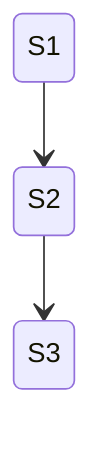
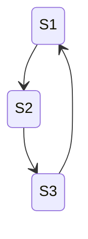
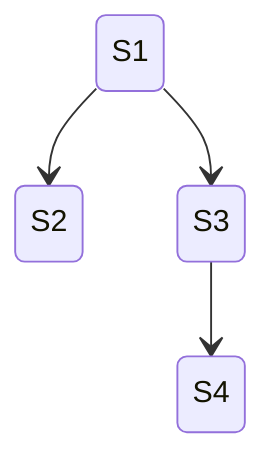
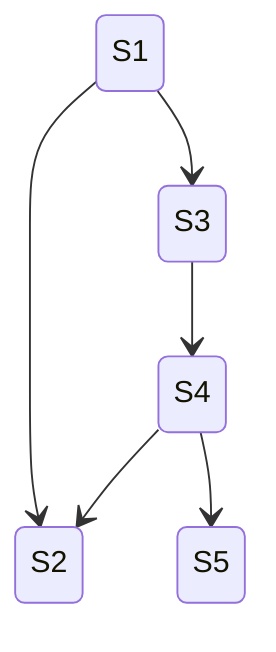
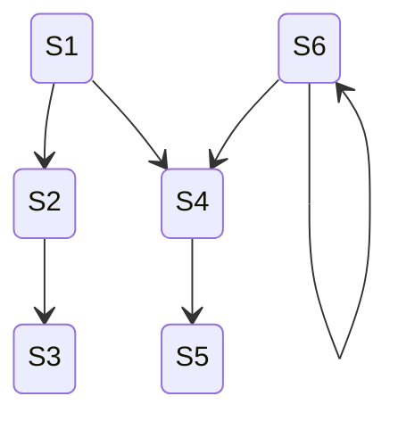

# StateMachineBuilder Test Plan

## Overview

`StateMachineBuilder` is the core engine of the StateMaker library. It takes an initial state, an array of rules, and a configuration object, then explores the state space by repeatedly applying rules to discovered states. The result is a `StateMachine` containing all reachable states and the transitions between them.

## StateMachine.Build

## Data Structures
### State
- `Variables`: Key-value pairs holding the state data. Supports primitive types: `string`, `int`, `bool`, `float`/`double`, and `null`.
- `Clone()`: Creates a shallow copy of the state with the same variable keys and values.
- Equality is value-based: two states are equal if they have the same keys with the same values.
- `GetHashCode()` uses sorted keys for deterministic hashing.
### IRule
- `IsAvailable(State)`: Returns `true` if the rule can be applied to the given state.
- `Execute(State)`: Applies the rule to produce a new state. Should not mutate the input state.
### BuilderConfig
- `MaxDepth` (default `null`): Maximum exploration depth from the initial state. States at this depth are added but not explored further. `null` means no depth limit.
- `MaxStates` (default `null`): Maximum number of states in the result. Once reached, no new states are added. `null` means no state count limit.
- `ExplorationStrategy` (default `BREADTHFIRSTSEARCH`): Controls the order in which states are explored.
- `LogLevel` (default `INFO`): Controls logging verbosity.
### ExplorationStrategy
- `BREADTHFIRSTSEARCH`: Explores states level by level (queue-based).
- `DEPTHFIRSTSEARCH`: Explores one branch fully before backtracking (stack-based).
### StateMachine
- `States`: Read-only dictionary mapping state IDs (e.g., "S0", "S1") to `State` objects.
- `StartingStateId`: The ID of the initial state. Setting this to a non-existent state ID throws `StateDoesNotExistException`.
- `Transitions`: List of all transitions discovered during exploration.
- `AddState(stateId, state)`: Adds a state to the internal dictionary.
- `RemoveState(stateId)`: Removes a state; clears `StartingStateId` if it matches.
- `IsValidMachine()`: Returns `true` if the machine has at least one state, a non-null `StartingStateId`, and all transitions reference existing states.
### Transition
- `SourceStateId`: The state the rule was applied to.
- `TargetStateId`: The state produced by the rule.
- `RuleName`: Derived from the rule's class name (`rule.GetType().Name`).
### StateDoesNotExistException

## Builder Behavior Summary

1. **Input validation**: Guards against null `initialState`, `rules`, `config`, and null elements within the `rules` array. Throws `ArgumentNullException` on violations.
2. **Initialization**: Adds the initial state as "S0" and sets it as `StartingStateId`.
3. **Exploration loop**: Uses a `LinkedList` as a unified frontier (FIFO for BFS, LIFO for DFS). For each state taken from the frontier, applies every rule:
   - If the rule is not available (`IsAvailable` returns `false`), skip it.
   - If the rule produces a state already visited (detected via `HashSet<State>` using value equality), record a transition to the existing state but do not re-explore.
   - If the rule produces a new state, add it to the machine, record the transition, and add it to the frontier for further exploration.
4. **Limits**: `MaxDepth` prevents exploring states beyond a configured depth. `MaxStates` stops adding new states once the count is reached.
5. **State IDs**: Generated sequentially as "S0", "S1", "S2", etc.
6. **Output**: Returns a `StateMachine` that satisfies `IsValidMachine() == true`.

## Test Sections
### state machine shapes
What happens when rules try to build different kinds of state machine shapes?
#### state machine shapes
- singlestate
    - single state of different types
- chains

    - chains of different length
- cycles

    - cycles of different depth
    - cycles that start at different points in the graph
    - cycles with complex shapes before returning back to origin
    - cycles within cycles
    - cycles with optional exits
- branches

    - number of peers at a branch
    - depth of branching
    - breadth of branching
    - sub-branches that are trees
    - sub-branches that are connected
    - fully connected branches
- branches that reconnect without cycles

    - depth from origin to reconnect
    - branches along the way to reconnect
- hybrid shapes

#### Generating state machines based on rules
**Cover each of the state machine shapes at least once**

**Are there different ways to build the same state machine?**
- create a definition that builds a certain shape
    - add rules which will not trigger
    - change rule order

**What kinds of rule behaviors in isAvailable and Execute can throw off the build?**
- always a unique state generated combined with no stop condition on isAvailable
- returning a bad state (what is that?)
- throwing
- internally hung
- edit the state given to Execute

**How resilient is the state machine build to error states?**

**What happens when rules describe an invalid build?**

**What happens based on different configuration options?**
**How does exploration strategy affect building?**

_(to be populated)_
