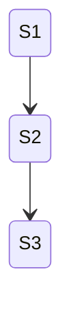
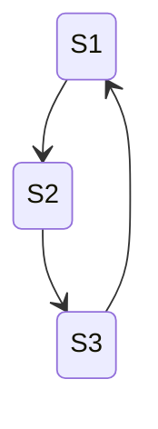
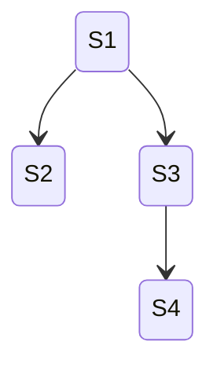
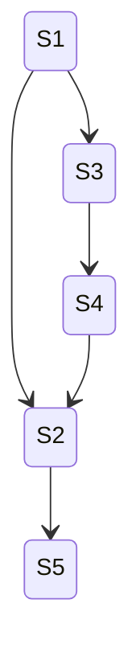
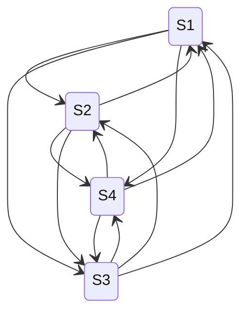
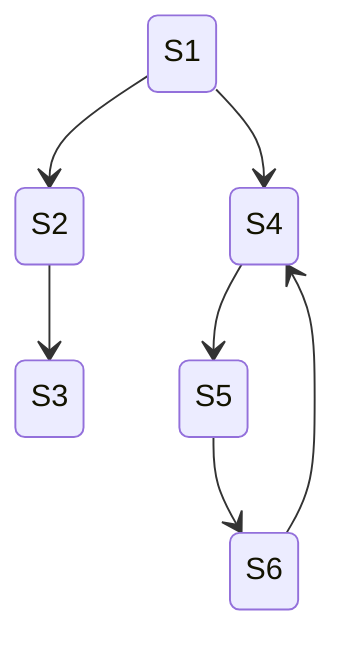

# StateMachineBuilder Test Plan

## Overview

`StateMachineBuilder` is the core engine of the StateMaker library. It takes an initial state, an array of rules, and a configuration object, then explores the state space by repeatedly applying rules to discovered states. The result is a `StateMachine` containing all reachable states and the transitions between them.

## StateMachine.Build

## Data Structures
### State
- `Variables`: Key-value pairs holding the state data. Supports primitive types: `string`, `int`, `bool`, `float`/`double`, and `null`.
- `Clone()`: Creates a shallow copy of the state with the same variable keys and values.
- Equality is value-based: two states are equal if they have the same keys with the same values.
- `GetHashCode()` uses sorted keys for deterministic hashing.
### IRule
- `IsAvailable(State)`: Returns `true` if the rule can be applied to the given state.
- `Execute(State)`: Applies the rule to produce a new state. Should not mutate the input state.
### BuilderConfig
- `MaxDepth` (default `null`): Maximum exploration depth from the initial state. States at this depth are added but not explored further. `null` means no depth limit.
- `MaxStates` (default `null`): Maximum number of states in the result. Once reached, no new states are added. `null` means no state count limit.
- `ExplorationStrategy` (default `BREADTHFIRSTSEARCH`): Controls the order in which states are explored.
- `LogLevel` (default `INFO`): Controls logging verbosity.
### ExplorationStrategy
- `BREADTHFIRSTSEARCH`: Explores states level by level (queue-based).
- `DEPTHFIRSTSEARCH`: Explores one branch fully before backtracking (stack-based).
### StateMachine
- `States`: Read-only dictionary mapping state IDs (e.g., "S0", "S1") to `State` objects.
- `StartingStateId`: The ID of the initial state. Setting this to a non-existent state ID throws `StateDoesNotExistException`.
- `Transitions`: List of all transitions discovered during exploration.
- `AddOrUpdateState(stateId, state)`: Adds or updates a state in the internal dictionary.
- `RemoveState(stateId)`: Removes a state; clears `StartingStateId` if it matches. Does not remove transitions referencing the removed state.
- `IsValidMachine()`: Returns `true` if the machine has at least one state, a non-null `StartingStateId`, and all transitions reference existing states.
### Transition
- `SourceStateId`: The state the rule was applied to.
- `TargetStateId`: The state produced by the rule.
- `RuleName`: Derived from `rule.GetName()` (defaults to `GetType().Name` if not overridden).
### StateDoesNotExistException

## Builder Behavior Summary

1. **Input validation**: Guards against null `initialState`, `rules`, `config`, and null elements within the `rules` array. Throws `ArgumentNullException` on violations.
2. **Initialization**: Adds the initial state as "S0" and sets it as `StartingStateId`.
3. **Exploration loop**: Uses a `LinkedList` as a unified frontier (FIFO for BFS, LIFO for DFS). For each state taken from the frontier, applies every rule:
   - If the rule is not available (`IsAvailable` returns `false`), skip it.
   - If the rule produces a state already in `stateToId` (detected via `Dictionary<State, string>` using value equality), record a transition to the existing state but do not re-explore.
   - If the rule produces a new state, add it to the machine, map it in `stateToId`, record the transition, and add it to the frontier for further exploration.
4. **Limits**: `MaxDepth` prevents exploring states beyond a configured depth. `MaxStates` stops adding new states once the count is reached.
5. **State IDs**: Generated sequentially as "S0", "S1", "S2", etc.
6. **Output**: Returns a `StateMachine` that satisfies `IsValidMachine() == true`.

## Test Sections
### Rule and Initial State shapes
This needs some details figured out. The relationships are complex. Rules do not always trigger right away. Sometimes the wind up going back to earlier states, sometimes not. Different rules may have different relationships to different state variables, etc.

**initial_state_shapes**
- no state variables
- one of each data type
- variable1=value, variable1=value1  <== rule combinations pretend not to know about value, but will set value1
- 1, 2, 3... N state variables

**depth_combinations**
Pairwise combination of these settings
Total number of combinations is 7^2 = 49
| MaxStates | MaxDepth |
| ----------- | ----------- |
| null | null |
| 0 | 0 |
| -1 | -1 |
| 1 | 1 |
| 2 | 2 |
| 3 | 3 |
| 10 | 10 |

**exploration_options**
Breadth_First
Depth_First


**rule_variations**
- empty
- {isAvailable=>true;variable1=>value1}
- {isAvailable=>true;variable1=>value2}
- {isAvailable=>true;variable2=>value2}
- {isAvailable=>true;new_variable=>value1}
- {isAvailable=>true;for_each_variable=>value + 1}

**4_rule_combinations**
Pairwise combination to make sets of 0-4 rules
Total number of combinations is 6^4 = 1296 rule combinations
| Rule1 | Rule2 | Rule3 | Rule4 |
| ----------- | ----------- |  ----------- | ----------- | 
| {isAvailable=>true;variable1=>value1} | {isAvailable=>true;variable1=>value1} | {isAvailable=>true;variable1=>value1} | {isAvailable=>true;variable1=>value1} |
| {isAvailable=>true;variable1=>value2} | {isAvailable=>true;variable1=>value1} | {isAvailable=>true;variable1=>value1} | {isAvailable=>true;variable1=>value1} |
| {isAvailable=>true;variable2=>value2} | {isAvailable=>true;variable1=>value1} | {isAvailable=>true;variable1=>value1} | {isAvailable=>true;variable1=>value1} |
| {isAvailable=>true;new_variable=>value1} | {isAvailable=>true;variable1=>value1} | {isAvailable=>true;variable1=>value1} | {isAvailable=>true;variable1=>value1} |
| {isAvailable=>true;for_each_variable=>value + 1} | {isAvailable=>true;variable1=>value1} | {isAvailable=>true;variable1=>value1} | {isAvailable=>true;variable1=>value1} |
| {isAvailable=>true;new_variable=>value1} | {isAvailable=>true;variable1=>value1} | {isAvailable=>true;variable1=>value1} | {isAvailable=>true;variable1=>value1} |
| empty | empty | empty | empty |

**combinations to make cases**
The following creates a massive number of cases. The oracles will be challenging:
- matches expected state machine shape -> how do we know what will be for so many?
- does not crash or otherwise throw
- does not enter infinite loop
- is performance worse than size of eventual machine -> this is in some cases exponential
- are max limits respected
```
Combine (initial_state_changes x depth_combinations x 4_rule_combinations)
= 8 * 49 * 1296 => 508032
```
- Creating the combinations programmatically should be simple.
- Generating expected state machine oracle will be difficult.
- limit check oracles will be programmatically easy
- abort or crash oracles are implicitly easy - can it run to end without any of those happening?
- performance is challenging, but a graph of time take to size of machine should show similar slopes
- infinite loop detection can use a heuristic threshold limit that we check later against performance curves
- same inputs should generate same state machine run both breadth_first and depth_first

TOOL: Create a tool which can start from **initial_state_changes**, **depth_combinations**, and **4_rule_combinations** and combine them together to create build machine definition files.
TOOL: Write something which will execute a battery of state machine build definitions and apply the oracles described above.

### state machine shapes
What happens when rules try to build different kinds of state machine shapes?
#### state machine shapes
- singlestate
    - single state of different types
- chains

    - chains of different length
- cycles

    - cycles of different depth
    - cycles that start at different points in the graph
    - cycles with complex shapes before returning back to origin
    - cycles within cycles
    - cycles with optional exits
- branches

    - number of peers at a branch
    - depth of branching
    - breadth of branching
    - sub-branches that are trees
    - sub-branches that are connected
    - fully connected branches
- branches that reconnect without cycles

    - depth from origin to reconnect
    - branches along the way to reconnect
- connected

```
   - every node to every other node
   - every node may eventually lead to every other node
   - number of nodes
```
- hybrid shapes

```
  - graphs with 2,3,N shapes - one of each
  - one of every shape and shape modification in same graph
  - same graph shapes appear multiple times 2, 3, etc.
  - connected and cycle shapes with branches off to trees or other connections and cycle neighborhoods
```
 
#### Generating state machines based on rules
**Are there different ways to build the same state machine?**
- create a definition that builds a certain shape
    - add rules which will not trigger
    - change rule order

TOOL: Create a tool which takes a state machine as input and generates one or more sets of rules that would build it.
Same tool could adjust the rules in ways that are different rules but not alter expected output.

> **Implemented**: See [Test Tools Guide](./test-tools-guide.md) for documentation on:
> - **TestCaseGenerator** — Combinatorial build definition generator (TOOL above for creating build definitions)
> - **TestBatteryExecutor** — Battery executor with 7 oracle checks (TOOL above for executing batteries and applying oracles)
> - **ReverseRuleGenerator** — Generates rules that produce specific state machine shapes, with rule ordering, split/merge, and non-triggering rule variations

**What kinds of rule behaviors in isAvailable and Execute can throw off the build?**
- always a unique state generated combined with no stop condition on isAvailable
- returning a bad state (what is that?)
- throwing
- internally hung
- edit the state given to Execute

**How resilient is the state machine build to error states?**
- what is an invalid build definition state?
- what is an invalid rule?
- what is an invalid state machine?

Make rules that would build invalid machines.
Build from invalid definitions.

_(to be populated)_
