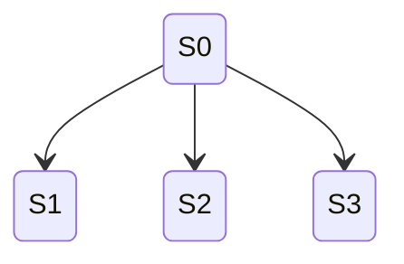
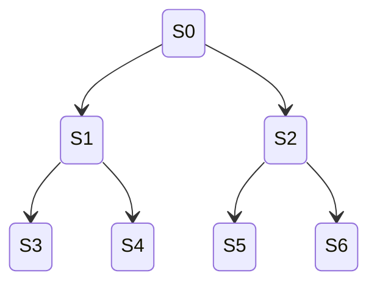
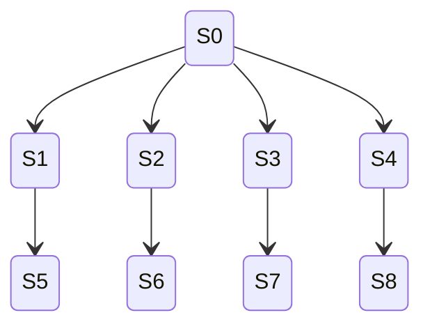
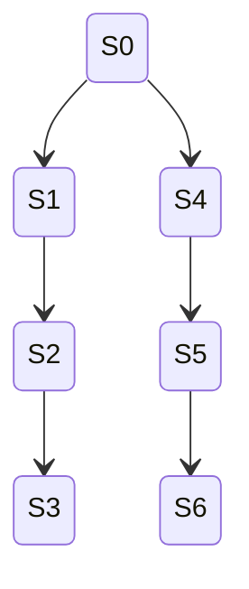
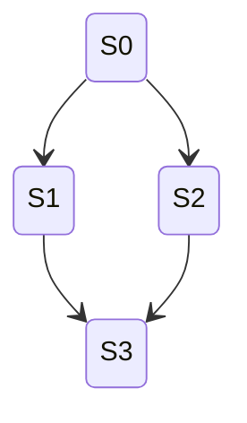
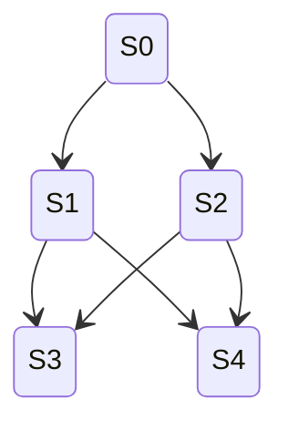

# PRD: State Machine Shape Verification Tests — Branching Shapes

## Overview

This document specifies the automated test suite for verifying that the `StateMachineBuilder` correctly produces state machines with branching topologies when given rules designed to build those shapes. This covers tree-like structures where states have multiple outgoing transitions to distinct successor states.

These tests extend the existing `StateMachineShapeTests.cs` test file and reuse the parameterized/data-driven approach established there.

## Goal

Verify that the builder correctly handles branching topologies including trees of varying peer count (fan-out), depth, and breadth, sub-branches forming independent trees, connected sub-branches (where branches share descendant states without reconverging), and fully connected branches (every branch state connects to every peer). This provides confidence that the builder's multi-rule exploration, state deduplication, and transition recording work correctly for non-linear, non-cyclic graphs.

## Scope — Task 3.14 Shapes

### 1. Varying Peer Count (Fan-out from Root)

A single root state with multiple outgoing transitions to distinct child states, each of which is a terminal state (no further transitions).



**Variations:**
- Fan-out of 2 (S0 → S1, S0 → S2)
- Fan-out of 3
- Fan-out of 5
- Fan-out of 10

**Expected shape:**
- `States.Count == peerCount + 1`
- `Transitions.Count == peerCount`
- Starting state has outDegree == peerCount, inDegree == 0
- Every child state has outDegree == 0, inDegree == 1
- No back-edges exist

**Oracles:**
- `States.Count == peerCount + 1`
- `Transitions.Count == peerCount`
- Starting state outDegree == peerCount
- All non-starting states have inDegree == 1, outDegree == 0
- `IsValidMachine() == true`

### 2. Varying Depth (Linear Branching at Each Level)

A tree where each non-leaf state has exactly 2 children, forming a complete binary tree of a given depth.



**Variations:**
- Depth 1 (root + 2 leaves) — 3 states, 2 transitions
- Depth 2 (root + 2 internal + 4 leaves) — 7 states, 6 transitions
- Depth 3 — 15 states, 14 transitions

**Expected shape (complete binary tree):**
- `States.Count == 2^(depth+1) - 1`
- `Transitions.Count == 2^(depth+1) - 2`
- Root has outDegree == 2, inDegree == 0
- Internal nodes have outDegree == 2, inDegree == 1
- Leaves have outDegree == 0, inDegree == 1
- No back-edges

**Oracles:**
- State and transition counts match formula
- All states reachable from starting state
- No state has inDegree > 1 (no convergence)
- `IsValidMachine() == true`

### 3. Varying Breadth (Wide Branching Trees)

A tree with high fan-out at the root but shallow depth, versus a narrow tree with greater depth.



**Variations:**
- Breadth 4, depth 1: root fans to 4 children, each child fans to 2 grandchildren — 4 + 8 + 1 = 13 states
- Breadth 2, depth 3: binary tree 3 levels deep — 15 states
- Breadth 3, depth 2: root fans to 3, each fans to 3 — 1 + 3 + 9 = 13 states

**Oracles:**
- State and transition counts match expected totals
- All states reachable
- Tree structure: no convergence (no state has inDegree > 1 except root which has 0)
- `IsValidMachine() == true`

### 4. Sub-branches as Trees

A root that branches into independent sub-trees, where each sub-tree is itself a chain or small tree.



**Variations:**
- Root branches to 2 independent chains of length 2
- Root branches to 2 independent chains of different lengths (2 and 3)
- Root branches to 3 independent chains of length 1
- Root branches to 2 independent sub-trees (each a binary tree of depth 1)

**Expected shape:**
- Total states = 1 + sum of states in each sub-tree
- Total transitions = fan-out from root + sum of transitions in each sub-tree
- Each sub-tree is independently a valid chain or tree
- No transitions between sub-trees

**Oracles:**
- State count matches expected total
- Transition count matches expected total
- All states reachable
- No cross-sub-tree transitions (sub-trees are independent)
- `IsValidMachine() == true`

### 5. Connected Sub-branches

Branches from the root that share some descendant states — a branch point followed by paths that lead to a common state (but not reconverging like a diamond, which is task 3.15). Here, one branch's leaf connects forward to a state in another branch's sub-tree.



Note: This is borderline with task 3.15 (reconnecting branches). The distinction is that here we test the simpler case where two branches lead to the same next state due to rule behavior producing identical states, which the builder deduplicates.

**Variations:**
- Two branches from root, both rules produce the same child state (deduplication to 2 states, 2 transitions)
- Root branches to 2 children, each child has a rule that produces the same grandchild (4 states, 4 transitions with dedup)
- Three branches from root, two produce the same child state (3 states: root + 2 distinct children)

**Oracles:**
- State deduplication occurs (fewer states than naively expected)
- States with inDegree > 1 exist (shared states)
- All states reachable
- `IsValidMachine() == true`

### 6. Fully Connected Branches

Every state at one level connects to every state at the next level (or every peer connects to every other peer).



**Variations:**
- 2 states at level 1, 2 states at level 2 — each L1 state connects to both L2 states (5 states, 6 transitions)
- 2 states at level 1, 3 states at level 2 (7 states, 8 transitions)
- 3 states at level 1, 2 states at level 2 (6 states, 9 transitions)

**Oracles:**
- States at level 1 have outDegree == level 2 count
- States at level 2 have inDegree == level 1 count
- State and transition counts match expected
- All states reachable
- `IsValidMachine() == true`

## Test Design

### Parameterized Test Approach

Tests should use `[Theory]` with `[InlineData]` or `[MemberData]` to cover shape variations. Each test method covers one branching category and iterates over the variations.

### Test File

All tests for this task go in the existing file:
```
src/StateMaker.Tests/StateMachineShapeTests.cs
```

### New Helper Rule Classes

Reuse existing `FuncRule`, `TransitionAt`, `IncrementRule` helpers. Additional helpers needed:

1. **`BranchRule`** — A rule that uses multiple variables to create branching behavior; each rule sets a different "branch" variable, creating distinct child states from the same parent
2. **Multi-variable composition** — Rules operating on different variables to create independent sub-trees

### New Helper Assertion Methods

1. **`AssertTreeShape(StateMachine machine, int expectedStates, int expectedTransitions)`** — Validates a tree topology: no state has inDegree > 1 (except shared states in connected branches), all states reachable, correct counts
2. **`AssertNoCycles(StateMachine machine)`** — Validates no back-edges exist (no transition targets an ancestor in any path from root)
3. **`AssertFanOut(StateMachine machine, string stateId, int expectedOutDegree)`** — Validates a specific state has the expected number of outgoing transitions

### Oracle Validation

For each shape, the oracle helpers should check:
- State count matches expected
- Transition count matches expected
- Graph structure matches expected (in-degree, out-degree per node)
- All states are reachable from the starting state
- No unintended cycles (for tree shapes)
- `IsValidMachine()` returns true

## Non-Goals

- Simple single-state, chain, or cycle shapes — covered by tasks 3.12–3.13
- Reconnecting branches (diamond/converging paths) — covered by task 3.15
- Hybrid shapes combining branches with cycles — covered by task 3.16
- Performance testing — covered by tasks 3.22–3.24

## Success Criteria

- All parameterized test cases pass
- Each branching category (peer count, depth, breadth, sub-branches, connected sub-branches, fully connected) has at least 3 distinct variations tested
- Tests are data-driven and easy to extend with new variations
- Tests extend the existing `StateMachineShapeTests.cs` file
- All existing tests continue to pass
