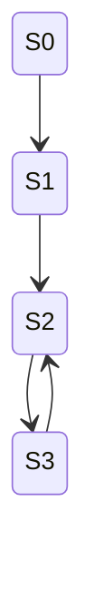
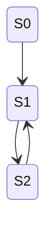
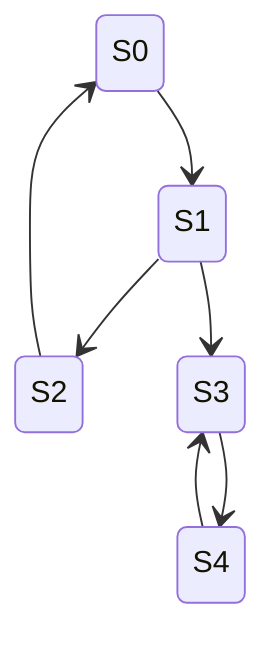
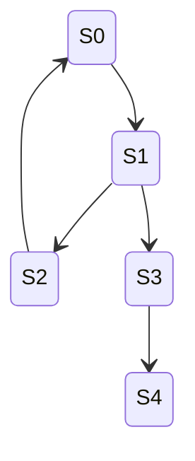

# PRD: State Machine Shape Verification Tests — Complex Cycles

## Overview

This document specifies the automated test suite for verifying that the `StateMachineBuilder` correctly produces state machines with complex cycle topologies when given rules designed to build those shapes. This covers cycles beyond the simple single-loop cycles tested in task 3.12.

These tests extend the existing `StateMachineShapeTests.cs` test file and reuse the parameterized/data-driven approach established there.

## Goal

Verify that the builder correctly handles complex cycle topologies including cycles of varying depth (with chain prefixes), cycles that start at different points in the graph, cycles within cycles (nested cycles), and cycles with optional exit branches. This provides confidence that the builder's cycle detection, state deduplication, and exploration work correctly for non-trivial cyclic graphs.

## Scope — Task 3.13 Shapes

### 1. Cycles of Varying Depth (Chain + Cycle)

A linear chain of states followed by a cycle at the end. The cycle begins at a state deeper in the graph, not at the initial state.



**Variations:**
- Chain of length 1 followed by cycle of length 2 (1 chain state, then a 2-state cycle)
- Chain of length 2 followed by cycle of length 2
- Chain of length 3 followed by cycle of length 3
- Chain of length 5 followed by cycle of length 2
- Chain of length 1 followed by cycle of length 5

**Expected shape:**
- `States.Count == chainLength + cycleLength`
- `Transitions.Count == chainLength + cycleLength`
- The first `chainLength` states form a linear chain (each has outDegree == 1, the first `chainLength - 1` have inDegree == 1, the first has inDegree == 0)
- The last `cycleLength` states form a cycle (each has outDegree == 1 and inDegree == 1, except the cycle entry state which has inDegree == 2: one from the chain, one from the cycle back-edge)
- The back-edge targets the cycle entry state, not the initial state

**Oracles:**
- `States.Count == chainLength + cycleLength`
- `Transitions.Count == chainLength + cycleLength`
- The initial state has outDegree == 1 and inDegree == 0
- Exactly one state has inDegree == 2 (the cycle entry state, receiving from chain and back-edge)
- No transition targets the initial state (back-edge goes to cycle entry, not S0)
- `IsValidMachine() == true`

### 2. Cycles That Start at Different Points

A cycle where the back-edge returns to a state other than S0 — specifically, the cycle may begin partway through the exploration. This is effectively a chain-then-cycle pattern where the chain prefix is explicit.



**Variations:**
- Cycle returns to S1 after a 1-state chain (S0 → S1 → S2 → S1)
- Cycle returns to S2 after a 2-state chain (S0 → S1 → S2 → S3 → S2)
- Cycle returns to S3 after a 3-state chain (S0 → S1 → S2 → S3 → S4 → S3)

These overlap with "cycles of varying depth" but the oracle emphasis is different: we specifically verify *which* state the back-edge targets.

**Oracles:**
- The back-edge transition's `TargetStateId` is NOT `StartingStateId`
- The back-edge target state has inDegree == 2
- `IsValidMachine() == true`

### 3. Cycles Within Cycles (Nested Cycles)

A state machine where the graph contains two or more distinct cycle substructures. One cycle is reachable from another.



**Variations:**
- Two adjacent cycles sharing a common state: outer cycle (S0 → S1 → S0) where S1 branches to an inner cycle (S1 → S2 → S3 → S2)
- Sequential cycles: a chain leads to cycle A, which exits to cycle B (S0 → S1 → S2 → S1 with exit S2 → S3 → S4 → S3)
- Two independent cycles from a branch point: S0 branches to both cycle A and cycle B
- Outer cycle of length 3 with inner cycle of length 2 off one state
- Outer cycle of length 2 with inner cycle of length 3 off one state

**Expected shape:**
- Multiple back-edges exist in the graph (one per cycle)
- At least one state has outDegree > 1 (the branch point entering the inner cycle)
- All states are reachable from the initial state

**Oracles:**
- Number of back-edges (transitions where target was already visited) == number of distinct cycles
- Every state is reachable from `StartingStateId` by following transitions
- `States.Count` matches expected total distinct states
- `Transitions.Count` matches expected total transitions
- `IsValidMachine() == true`

### 4. Cycles with Optional Exits

A cycle where one or more states in the cycle also have outgoing transitions to states outside the cycle (exit branches).



**Variations:**
- Simple cycle of length 2 with one exit branch of length 1 (S0 → S1 → S0, S0 → S2)
- Simple cycle of length 3 with one exit branch of length 1
- Simple cycle of length 3 with exit branch of length 3 (a chain dangling off the cycle)
- Cycle of length 2 with exit branches from every state in the cycle
- Cycle of length 3 with two exit branches from the same state

**Expected shape:**
- The cycle states have the expected cycle structure (back-edge exists)
- At least one state in the cycle has outDegree > 1 (the cycle transition + the exit transition)
- The exit branch states have no path back to the cycle (they are chain tails or terminate)

**Oracles:**
- A cycle of the expected length exists (identifiable by back-edge count)
- States outside the cycle have no transitions targeting cycle states (no re-entry from exits)
- Total `States.Count` == cycle states + exit branch states
- Total `Transitions.Count` == cycle transitions + exit branch transitions
- `IsValidMachine() == true`

## Test Design

### Parameterized Test Approach

Tests should use `[Theory]` with `[MemberData]` or `[InlineData]` to cover shape variations. Each test method covers one complex cycle category and iterates over the variations.

### Test File

All tests for this task go in the existing file:
```
src/StateMaker.Tests/StateMachineShapeTests.cs
```

### New Helper Rule Classes

The existing helper rules from task 3.12 (`IncrementRule`, `ModularCycleRule`, etc.) may be reused. Additional helpers may be needed:

1. **`ChainThenCycleRule`** or composed rules — A rule (or pair of rules) that increments a variable through a chain phase, then cycles through a cycle phase using modular arithmetic on a subset of values
2. **`ConditionalBranchRule`** — A rule that creates a branch from a specific state (fires only when a variable has a specific value), producing an exit path from a cycle
3. **Multi-rule compositions** — Several rules working together on different variables to create nested cycle structures

### New Helper Assertion Methods

1. **`AssertChainThenCycleShape(StateMachine machine, int chainLength, int cycleLength)`** — Validates a chain prefix followed by a cycle: total state count, transition count, chain structure in the prefix, cycle structure in the suffix, back-edge targets cycle entry (not S0)
2. **`AssertContainsCycle(StateMachine machine, int cycleLength)`** — Validates that a cycle of the expected length exists somewhere in the graph by finding back-edges and tracing the cycle path
3. **`AssertAllStatesReachable(StateMachine machine)`** — Validates that every state is reachable from `StartingStateId` by following transitions (BFS/DFS traversal of the graph)

### Oracle Validation

For each shape, the oracle helpers should check:
- State count matches expected
- Transition count matches expected
- Back-edge targets match expected (which state the cycle returns to)
- In-degree and out-degree per node match expected topology
- All states are reachable from the starting state
- `IsValidMachine()` returns true

## Non-Goals

- Simple single-loop cycles — covered by task 3.12
- Branching shapes without cycles — covered by task 3.14
- Reconnecting branches (diamond/converging paths) — covered by task 3.15
- Hybrid shapes combining cycles with other topologies — covered by task 3.16
- Performance testing — covered by tasks 3.22–3.24

## Success Criteria

- All parameterized test cases pass
- Each complex cycle category (varying depth, different start points, nested cycles, optional exits) has at least 3 distinct variations tested
- Tests are data-driven and easy to extend with new variations
- Tests extend the existing `StateMachineShapeTests.cs` file
- All 112+ existing tests continue to pass