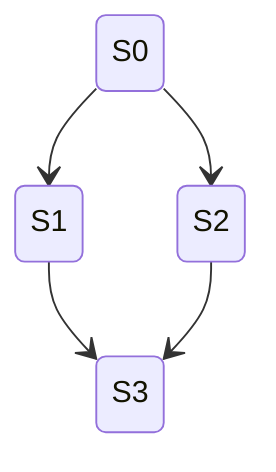
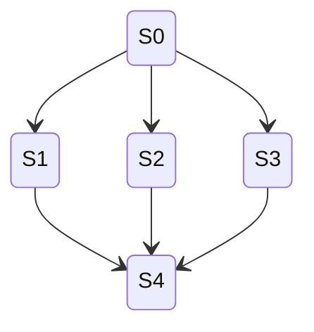
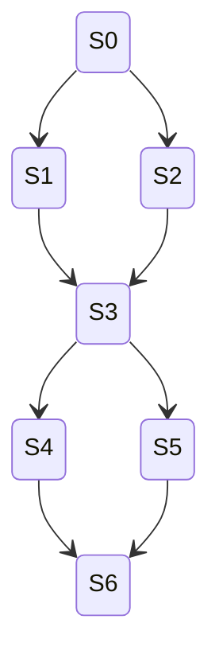
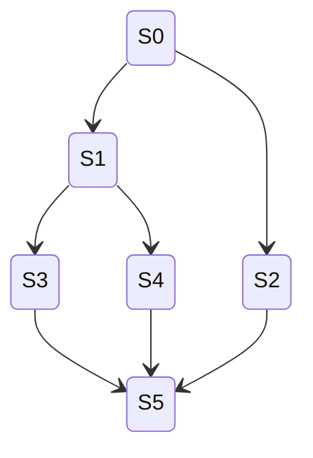
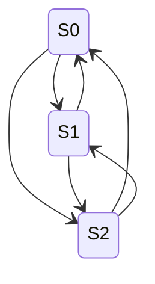

# PRD: State Machine Shape Verification Tests — Reconnecting Branches and Fully Connected Graphs

## Overview

This document specifies the automated test suite for verifying that the `StateMachineBuilder` correctly produces state machines with reconnecting branch (diamond/converging) topologies and fully connected graph structures. These shapes involve multiple paths from the starting state that converge at common descendant states, as well as graphs where every state connects to every other state.

These tests extend the existing `StateMachineShapeTests.cs` test file and reuse the parameterized/data-driven approach established there.

## Goal

Verify that the builder correctly handles:
1. **Diamond/converging paths** — two or more branches from a common ancestor that reconverge at a shared descendant state (state deduplication across independent paths)
2. **Multi-level diamonds** — diamonds stacked or nested within diamonds
3. **Wide convergence** — many branches converging to a single state
4. **Fully connected graphs** — every state has transitions to every other state (complete graphs of varying node counts)

This provides confidence that the builder's state deduplication via `HashSet<State>` works correctly when identical states are produced by different execution paths.

## Scope — Task 3.15 Shapes

### 1. Simple Diamond (2-Branch Convergence)

Two branches from a root state that converge at a single descendant state.



**Variations:**
- Classic diamond: root branches to 2 children, both produce same grandchild (4 states, 4 transitions)
- Diamond with chain prefix: chain of length 1 then diamond (5 states, 5 transitions)
- Diamond with chain suffix: diamond then shared chain of length 1 (5 states, 5 transitions)
- Deep diamond: root branches to 2 children, each goes through a 2-step chain before converging (6 states, 6 transitions: S0->S1->S3->S5, S0->S2->S4->S5)

**Oracles:**
- Exactly one state has inDegree == 2 (the convergence point)
- State count matches expected (fewer than if branches were independent)
- All states reachable from starting state
- `IsValidMachine() == true`

### 2. Multi-Branch Convergence (Wide Diamond)

More than 2 branches from a root that all converge at the same descendant state.



**Variations:**
- 3-way convergence: root branches to 3 children, all produce same grandchild (5 states, 6 transitions)
- 4-way convergence: root branches to 4 children, all converge (6 states, 8 transitions)
- 5-way convergence: root branches to 5 children, all converge (7 states, 10 transitions)

**Oracles:**
- Convergence point has inDegree == N (number of branches)
- State count == 1 (root) + N (children) + 1 (convergence) = N + 2
- Transition count == N (root to children) + N (children to convergence) = 2N
- All states reachable
- `IsValidMachine() == true`

### 3. Stacked Diamonds (Sequential Convergence)

Multiple diamond patterns in sequence — a diamond converges, then branches again and reconverges.



**Variations:**
- Two stacked diamonds: first diamond converges at S3, S3 branches again and converges at S6 (7 states, 8 transitions)
- Three stacked diamonds (10 states, 12 transitions)
- Stacked diamond with different branch counts: first diamond 2-way, second diamond 3-way

**Oracles:**
- Multiple convergence points exist (one per diamond)
- State count and transition count match expected totals
- All states reachable
- `IsValidMachine() == true`

### 4. Nested Diamonds (Diamond Within Diamond)

A diamond where one or both branches themselves contain a sub-diamond.



**Variations:**
- One branch is a sub-diamond, other branch goes directly to convergence point
- Both branches contain sub-diamonds that converge at the same final state
- Sub-diamond with chain then convergence

**Oracles:**
- Convergence point has correct inDegree (accounting for sub-diamond paths)
- State and transition counts match expected
- All states reachable
- `IsValidMachine() == true`

### 5. Fully Connected Graphs (Complete Graphs)

Every state has a transition to every other state. For K states, there are K*(K-1) directed transitions.



**Variations:**
- K=2: 2 states, 2 transitions (cycle)
- K=3: 3 states, 6 transitions
- K=4: 4 states, 12 transitions
- K=5: 5 states, 20 transitions

**Implementation approach:** Use a modular arithmetic scheme with multiple rules. For K states, use K-1 rules that each add a different offset modulo K to a state variable. Each rule produces a distinct successor state, and since all K states exist, every state connects to every other state.

**Oracles:**
- `States.Count == K`
- `Transitions.Count == K * (K - 1)`
- Every state has outDegree == K - 1
- Every state has inDegree == K - 1
- All states reachable
- `IsValidMachine() == true`

## Test Design

### Parameterized Test Approach

Tests should use `[Theory]` with `[InlineData]` or `[MemberData]` where variations are parameterizable. Use `[Fact]` for complex shapes that require unique rule setups.

### Test File

All tests for this task go in the existing file:
```
src/StateMaker.Tests/StateMachineShapeTests.cs
```

### New Helper Assertion Methods

1. **`AssertDiamondShape(StateMachine machine, int branchCount, int expectedStates, int expectedTransitions)`** — Validates diamond topology: convergence point has inDegree == branchCount, correct state/transition counts, all reachable
2. **`AssertFullyConnected(StateMachine machine, int nodeCount)`** — Validates complete graph: K states, K*(K-1) transitions, every state has outDegree and inDegree == K-1

### Reusable Helpers

Reuse existing helpers: `TransitionAt`, `FuncRule`, `AssertAllStatesReachable`, `AssertTreeShape`.

## Non-Goals

- Simple branching without convergence — covered by task 3.14
- Cycles (simple, complex, nested) — covered by tasks 3.12–3.13
- Hybrid shapes combining branches with cycles — covered by task 3.16
- Performance testing — covered by tasks 3.22–3.24

## Success Criteria

- All parameterized test cases pass
- Each category (simple diamond, wide convergence, stacked diamonds, nested diamonds, fully connected) has at least 3 distinct variations tested
- Tests are data-driven and easy to extend
- Tests extend the existing `StateMachineShapeTests.cs` file
- All 150+ existing tests continue to pass
