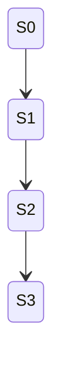
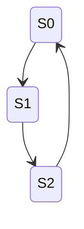

# PRD: State Machine Shape Verification Tests — Basic Shapes

## Overview

This document specifies the automated test suite for verifying that the `StateMachineBuilder` correctly produces state machines with specific graph topologies when given rules designed to build those shapes. This covers the three basic shape categories: single state, chains, and simple cycles.

These tests live in a separate test file from `StateMachineBuilderTests.cs` and use a parameterized/data-driven approach to cover shape variations at scale.

## Goal

Verify that the builder produces the correct number of states, transitions, and graph structure for rules intentionally designed to create known shapes. This provides confidence that the builder's exploration, cycle detection, and state deduplication work correctly across a range of topologies.

## Scope — Task 3.12 Shapes

### 1. Single State

A state machine with exactly one state and no transitions (or only self-loop transitions).

**Variations:**
- No rules at all (empty rules array)
- One rule where `IsAvailable` always returns `false`
- Multiple rules where `IsAvailable` always returns `false`
- One rule where `Execute` returns a clone of the input state (equivalent state — cycle back to self)
- Initial state with different variable types: string, int, bool, float
- Initial state with no variables (empty state)

**Expected shape:**
```
S0 (no outgoing transitions, or a single self-transition back to S0)
```

**Oracles:**
- `States.Count == 1`
- `Transitions.Count == 0` when no rules fire, or `Transitions.Count == N` (one per rule that fires and produces an equivalent state)
- All transitions (if any) have `SourceStateId == TargetStateId == S0`
- `IsValidMachine() == true`

### 2. Chains

A linear sequence of states where each state has exactly one outgoing transition to the next state. The last state has no outgoing transitions (or its rule stops being available).



**Variations:**
- Chain of length 1 (initial state + 1 new state)
- Chain of length 2
- Chain of length 3
- Chain of length 5
- Chain of length 10
- Chain built by incrementing an integer variable (`step = step + 1`) with an `IsAvailable` guard (`step < N`)
- Chain built by appending to a string variable (`status` cycles through known values)

**Expected shape:**
- `States.Count == N + 1` (initial state plus N generated states)
- `Transitions.Count == N`
- Each transition `T[i]` has `SourceStateId == S[i]` and `TargetStateId == S[i+1]`
- No state appears as a target more than once (no convergence)
- No state appears as a source more than once (no branching)

**Oracles:**
- `States.Count == chainLength + 1`
- `Transitions.Count == chainLength`
- Each state (except the last) has exactly one outgoing transition
- Each state (except the first) has exactly one incoming transition
- `IsValidMachine() == true`

### 3. Simple Cycles

A sequence of states where the last state transitions back to a previously visited state (typically the initial state).



**Variations:**
- Cycle of length 2 (toggle: `S0 → S1 → S0`)
- Cycle of length 3 (`S0 → S1 → S2 → S0`)
- Cycle of length 5
- Cycle of length 10
- Cycle built by modular arithmetic (`value = (value + 1) % N`)
- Cycle built by cycling through a known list of string values

**Expected shape:**
- `States.Count == N` (the cycle contains exactly N distinct states)
- `Transitions.Count == N` (N transitions forming the cycle, including the back-edge)
- Exactly one transition has `TargetStateId` equal to the starting state (the cycle-closing edge)
- Every state has exactly one outgoing and one incoming transition

**Oracles:**
- `States.Count == cycleLength`
- `Transitions.Count == cycleLength`
- Exactly one transition where `TargetStateId == StartingStateId` (the back-edge)
- Every state has `outDegree == 1` and `inDegree == 1`
- `IsValidMachine() == true`

## Test Design

### Parameterized Test Approach

Tests should use `[Theory]` with `[MemberData]` or `[InlineData]` to avoid duplicating test methods for each variation. Each test method covers one shape category and iterates over the variations.

### Test File

All tests for this task go in:
```
src/StateMaker.Tests/StateMachineShapeTests.cs
```

### Test Class Structure

```csharp
public class StateMachineShapeTests
{
    // Helper: creates a rule that increments an int variable, guarded by a max value
    // Helper: creates a rule that cycles a value using modular arithmetic
    // Helper: asserts chain shape (state count, transition count, linear structure)
    // Helper: asserts cycle shape (state count, transition count, back-edge)

    // [Fact] or [Theory] tests for single-state shapes
    // [Theory] tests for chains of varying length
    // [Theory] tests for cycles of varying length
}
```

### Helper Utilities

The test class should include reusable helper methods:

1. **`CreateChainRule(string variable, int maxValue)`** — Returns a rule that increments a variable from 0 up to `maxValue - 1`, producing a chain of `maxValue + 1` states
2. **`CreateCycleRule(string variable, int cycleLength)`** — Returns a rule that uses modular arithmetic (`value = (value + 1) % cycleLength`), producing a cycle of `cycleLength` states
3. **`AssertChainShape(StateMachine machine, int expectedLength)`** — Validates the machine has the expected chain topology
4. **`AssertCycleShape(StateMachine machine, int expectedCycleLength)`** — Validates the machine has the expected cycle topology

### Oracle Validation Helpers

For each shape, the oracle helpers should check:
- State count matches expected
- Transition count matches expected
- Graph structure matches expected (in-degree, out-degree per node)
- `IsValidMachine()` returns true
- No unexpected transitions exist

## Non-Goals

- Complex cycles (varying start points, nested cycles, exit branches) — covered by task 3.13
- Branching shapes — covered by task 3.14
- Reconnecting branches and fully connected graphs — covered by task 3.15
- Hybrid shapes — covered by task 3.16
- Performance testing or combinatorial explosion testing — covered by tasks 3.22–3.24

## Success Criteria

- All parameterized test cases pass
- Each shape category (single state, chain, cycle) has at least 5 distinct variations tested
- Tests are data-driven and easy to extend with new variations
- Test file is separate from `StateMachineBuilderTests.cs`
- All 87+ existing tests continue to pass